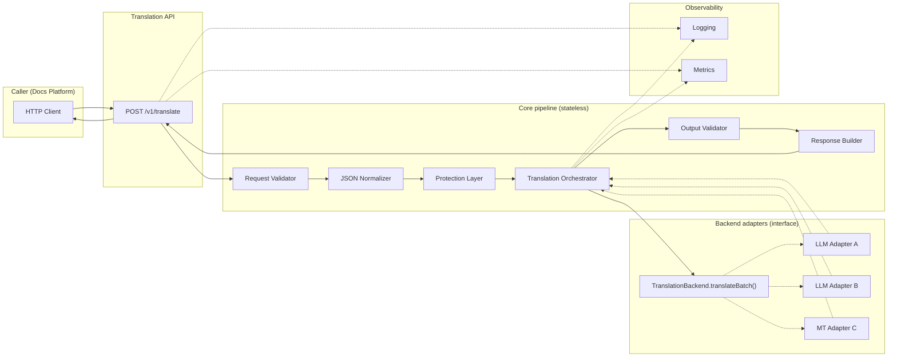

# Translation Service — Architecture (Mermaid)

This document visualizes the architecture described in
[translation-service-plan.md](./translation-service-plan.md).

## v1 request pipeline (synchronous)

High-level flow: client request through validation, normalization,
placeholder protection, orchestration, backend translation, output
validation, and response assembly.

